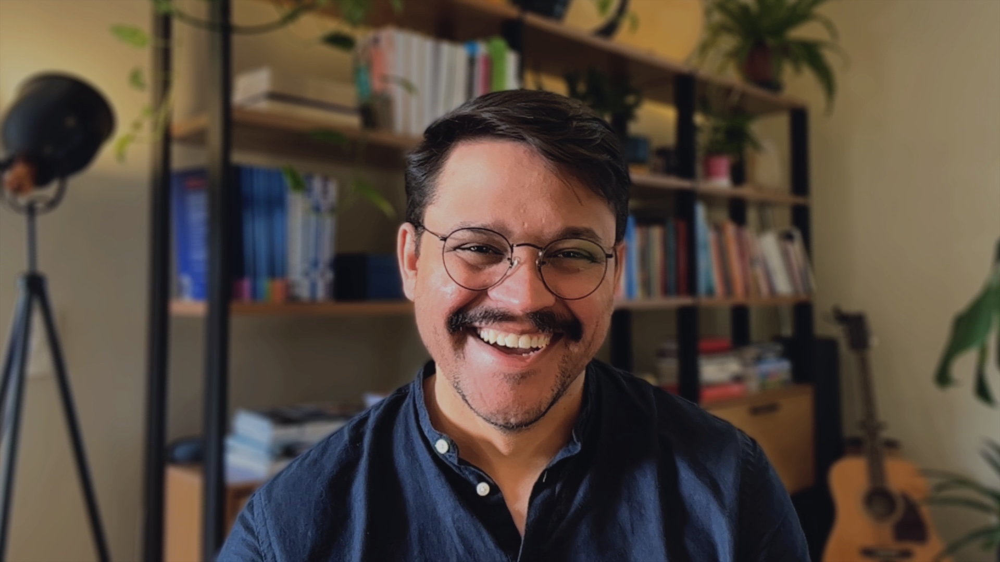
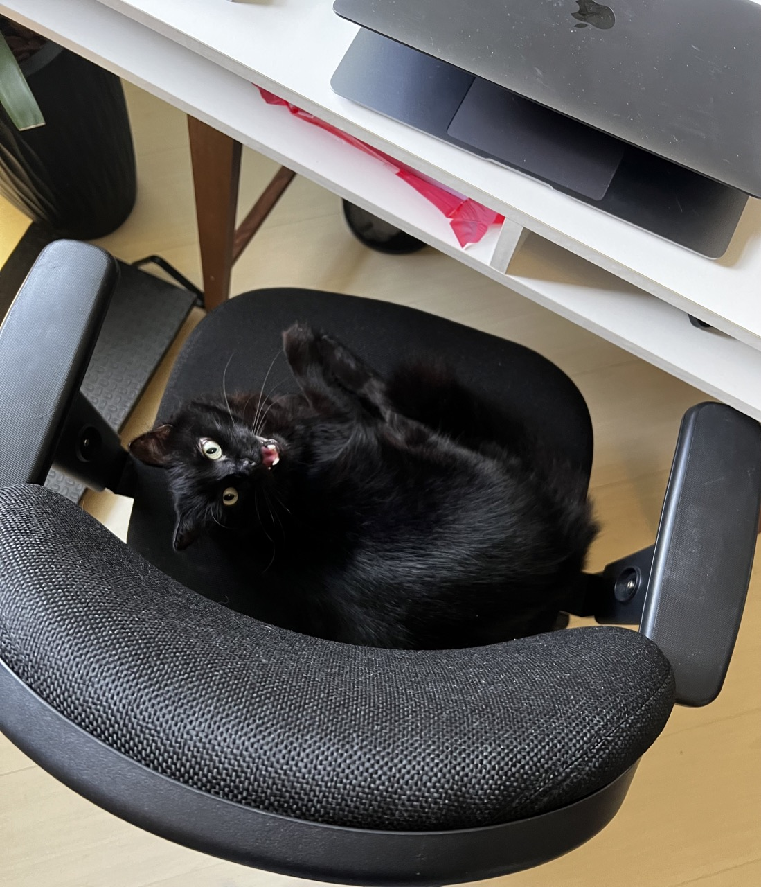

## Hello everyone 👋

👨🏾‍💻 I'm **Davi**, a **Python Backend Specialist Developer** and currently seeking new professional opportunities and throughout my career, I have had the opportunity to work on various challenging projects, contributing to the success and growth of the companies I have been involved with.

✨ **My highlights are:** ✨ \
• With over 19 years of experience in the technology industry, including 15 years as a specialized Python backend developer, I possess extensive knowledge and expertise in this field.\
• Solid experience with web frameworks, libraries, and technologies: Flask, Celery, RabbitMQ, MySQL, MongoDB, Redis;\
• As well as an understanding of: FastApi, Pub/Sub, Elasticsearch, Postgres;\
• Experienced in finding appropriate solutions to problems through software architecture;\
• Good knowledge of agile software development methodologies: Scrum and Kanban;\
• Experience working in small and large remote distributed teams;\
• Experience with cloud technologies, mainly with AWS services such as EC2, S3, Route53, CloudWatch, and SQS;\
• Strong knowledge of OOP, design patterns, designing application systems from scratch, and database modeling.

🔭 I'm well-equipped to handle projects at different stages, from initial development to scalability and large-scale operations. I have experience in designing and implementing efficient algorithms, taking into consideration time and space complexity. I also have skills in system architecture and design, ensuring optimal performance. I'm open to opportunities where I can apply my expertise to achieve successful outcomes.

🌟 I'm always seeking new challenges that allow me to utilize my experience and skills to create innovative and efficient solutions. I have a passion for programming and continuously update my knowledge to stay aligned with current best practices and technologies.

📚 I'm studying Data Science for Business to build bridges between the business and technical areas. The course covers technology, statistics, and business knowledge.

⏭️ Furthermore: \
If you have any questions or want to talk to me, feel free to send me an inbox message. 
 
💬 Here's my linkedin profile [@daviguides](https://www.linkedin.com/in/daviguides/)
💬 And Link to my [Profile](https://daviguides.github.io/)

 

👨‍💻 I am a very curious and proactive professional with a great capacity to absorb new knowledge. I always seek to think creatively, practically, and systematically to achieve the most relevant results for the business. I always ask myself: What pain are we addressing here? How much value and differentiation will this add to the company? If the answer is positive, I try to understand which part of the whole will bring the greatest impact. Whether alone or in a group, it is a pleasure to accomplish and see things happen.

As a neurodivergent person with Giftedness, my hyperfocus and commitment are focused on continuous learning and improvement, respecting both my uncommon abilities, such as divergent deep thinking, whole-detail perspective, integration of opposing ideas and perspectives, among others, and the limitations of my condition, such as hyperesthesia and hypersensitivities, among others.

I thrive in projects that offer constant growth opportunities and challenges, particularly those with a data-driven, pragmatic, ethical, and pluralistic decision-making approach.

😄 Pronouns: He/Him 🌈

😻 Fun fact: I have a beautiful black cat who sometimes shows up to say hello in meetings or do some pair programming with me.

<!--
**daviguides/daviguides** is a ✨ _special_ ✨ repository because its `README.md` (this file) appears on your GitHub profile.

Here are some ideas to get you started:

- 🔭 I’m currently working on ...
- 🌱 I’m currently learning ...
- 👯 I’m looking to collaborate on ...
- 🤔 I’m looking for help with ...
- 💬 Ask me about ...
- 📫 How to reach me: ...
- 😄 Pronouns: ...
- ⚡ Fun fact: ...
-->
